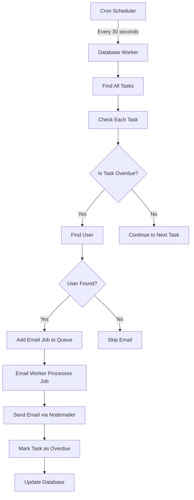
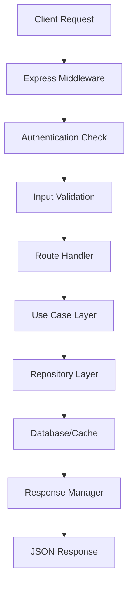

# Todo Redis - Task Management System

A robust task management system built with Node.js, TypeScript, MongoDB, and Redis. Features automated email reminders for overdue tasks using BullMQ job queues.

## 🚀 Features

- **Task Management**: Create, update, delete, and manage tasks with due dates
- **User Authentication**: JWT-based authentication with 3-day token expiry
- **Automated Email Reminders**: Background jobs send email notifications for overdue tasks
- **Queue Management**: Redis-powered job queues using BullMQ
- **Scheduled Jobs**: Automated database checks for overdue tasks
- **Clean Architecture**: Layered architecture with repositories, use cases, and handlers

## 🏗️ Architecture

The project follows a clean architecture pattern with the following layers:

```
src/
├── config/           # Configuration files and types
├── database/         # Database connection and setup
├── engine/           # Background job processing
│   ├── jobs/         # Job definitions
│   ├── queues/       # Queue configurations
│   ├── schedulers/   # Cron job schedulers
│   └── workers/      # Job processors
├── handlers/         # HTTP request handlers
├── managers/         # Business logic managers
├── middleware/       # Express middleware
├── models/           # Database models and types
├── repositories/     # Data access layer
├── routes/           # API route definitions
├── service/          # External service integrations
├── usecases/         # Business use cases
├── utils/            # Utility functions
└── validation/       # Input validation schemas
```

## 📋 System Flow

### Task Reminder System Flow



### API Request Flow



## 🛠️ Tech Stack

- **Runtime**: Node.js with TypeScript
- **Framework**: Express.js
- **Database**: MongoDB with Mongoose ODM
- **Cache/Queue**: Redis with BullMQ
- **Authentication**: JWT with Passport.js
- **Email**: Nodemailer
- **Validation**: Joi
- **Scheduling**: node-cron

## 📦 Installation

1. **Clone the repository**
   ```bash
   git clone <repository-url>
   cd todo-redis
   ```

2. **Install dependencies**
   ```bash
   npm install
   ```

3. **Environment Setup**
   Create a `.env` file in the root directory:
   ```env
   # Database
   MONGO_URI=mongodb://localhost:27017/todo-redis
   
   # Redis
   REDIS_HOST=localhost
   REDIS_PORT=6379
   REDIS_PASSWORD=
   
   # JWT
   JWT_SECRET=your-secret-key
   
   # Email Configuration
   SMTP_HOST=smtp.gmail.com
   SMTP_PORT=587
   SMTP_USER=your-email@gmail.com
   SMTP_PASS=your-app-password
   ```

4. **Start the services**
   ```bash
   # Start MongoDB (if running locally)
   mongod
   
   # Start Redis (if running locally)
   redis-server
   ```

5. **Run the application**
   ```bash
   npm start
   ```

The server will start on `http://localhost:3050`

## 🔧 Configuration

### Redis Configuration
- **Eviction Policy**: Set to `noeviction` for production
- **Connection**: Configured in `src/config/redis.config.ts`

### Email Configuration
- **Provider**: Supports SMTP (Gmail, Outlook, etc.)
- **Templates**: Customizable email templates for reminders

### Job Scheduling
- **Database Check**: Runs every 30 seconds
- **Email Processing**: Immediate processing with retry logic

## 📚 API Endpoints

### Authentication
- `POST /api/auth/register` - Register new user
- `POST /api/auth/login` - User login
- `GET /api/auth/profile` - Get user profile

### Tasks
- `GET /api/tasks` - Get all tasks
- `POST /api/tasks` - Create new task
- `GET /api/tasks/:id` - Get task by ID
- `PUT /api/tasks/:id` - Update task
- `DELETE /api/tasks/:id` - Delete task

## 🔄 Background Jobs

### Database Worker
- **Purpose**: Check for overdue tasks
- **Frequency**: Every 30 seconds via cron
- **Process**: 
  1. Fetch all tasks from database
  2. Check if `dueTime < currentTime` and `overdue === false`
  3. Send email reminder if user exists
  4. Mark task as overdue

### Email Worker
- **Purpose**: Process email sending jobs
- **Queue**: `QUEUE.EMAIL`
- **Jobs**: 
  - `sendWelcomeEmail` - Welcome emails for new users
  - `sendReminderEmail` - Overdue task reminders

## 🗄️ Database Schema

### User Model
```typescript
{
  _id: ObjectId,
  firstName: string,
  lastName: string,
  email: string,
  password: string, // bcrypt hashed
  createdAt: Date,
  updatedAt: Date
}
```

### Task Model
```typescript
{
  _id: ObjectId,
  title: string,
  description?: string,
  userId: ObjectId,
  type: TaskType,
  priority: PriorityLevel,
  status: ProgressStatus,
  overdue: boolean,
  dueTime?: Date,
  deletedAt?: Date,
  createdAt: Date,
  updatedAt: Date
}
```

## 🚦 Job Queue Management

### Queue Configuration
- **Database Queue**: Handles database operations
- **Email Queue**: Handles email sending
- **Retry Logic**: 2 attempts with exponential backoff
- **Cleanup**: Removes completed jobs (keep last 10)

### Monitoring
- Job completion logs with timestamps
- Error handling with detailed logging
- Queue status monitoring

## 🔍 Development

### Project Structure
```
src/
├── config/           # App configuration
├── database/         # DB connection
├── engine/           # Background processing
├── handlers/         # Request handlers
├── managers/         # Business logic
├── middleware/       # Express middleware
├── models/           # Data models
├── repositories/     # Data access
├── routes/           # API routes
├── service/          # External services
├── usecases/         # Business use cases
├── utils/            # Utilities
└── validation/       # Input validation
```

### Key Components

1. **Queue Manager** (`src/managers/queue.manager.ts`)
   - Centralized queue management
   - Worker creation and configuration

2. **Task Use Case** (`src/usecases/tasks.usecase.ts`)
   - Business logic for task operations
   - Interfaces with repository layer

3. **Email Service** (`src/service/mail.service.ts`)
   - Email sending functionality
   - SMTP configuration

4. **Authentication** (`src/service/auth.service.ts`)
   - JWT token management
   - Password hashing

## 🔧 Troubleshooting

### Common Issues

1. **Redis Connection Timeout**
   - Check Redis server is running
   - Verify connection settings in `.env`

2. **Email Not Sending**
   - Verify SMTP credentials
   - Check email worker logs
   - Ensure tasks have valid due dates

3. **Database Connection Issues**
   - Check MongoDB is running
   - Verify MONGO_URI in `.env`

### Logging
- Application logs include timestamps
- Job processing logs show success/failure
- Error logs include stack traces

## 📈 Performance Considerations

- **Database Indexing**: Index on `userId`, `dueTime`, and `overdue` fields
- **Queue Optimization**: Configurable job retention and cleanup
- **Connection Pooling**: MongoDB and Redis connection pooling
- **Caching**: Redis caching for frequently accessed data

## 🤝 Contributing

1. Fork the repository
2. Create a feature branch
3. Make your changes
4. Add tests if applicable
5. Submit a pull request

## 📄 License

This project is licensed under the ISC License.

## 🆘 Support

For support and questions:
- Check the troubleshooting section
- Review the logs for error details
- Ensure all dependencies are properly installed
